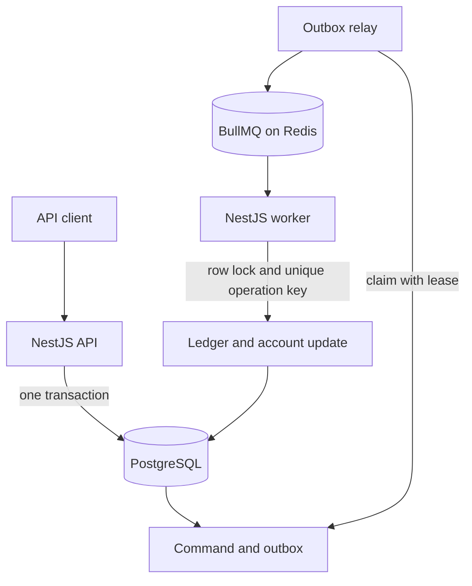

# NestJS BullMQ Idempotency Lab

A production-shaped reference for asynchronous commands that may be delivered more than once but must change business state only once.

The system accepts a credit command, records it with an outbox message in one PostgreSQL transaction, publishes the message to BullMQ, and applies the credit through an idempotent ledger transaction. A separate controlled lab proves what happens after exceptions, worker termination, stalled jobs, and duplicate producer requests.

This is the companion implementation for [Why BullMQ Jobs Run Twice: Retries, Stalls, and Idempotent Side Effects](https://waleedbukhari.com/blog/why-bullmq-jobs-run-twice).

## What this repository proves

- A successful API response cannot exist without a durable command and outbox record.
- Retrying the same API request with the same payload returns the original command.
- Reusing an idempotency key with a different payload is rejected.
- BullMQ retries and stalled-job recovery can execute the processor again.
- A database uniqueness boundary and one transaction prevent the second business effect.
- A deterministic BullMQ job ID reduces duplicate queue entries, but is not the business correctness boundary.

It does **not** claim distributed exactly-once delivery. The design accepts at-least-once execution and makes the business operation idempotent.

## Architecture



PostgreSQL owns the business invariant. Redis and BullMQ provide delivery, scheduling, retry, and worker coordination. See [Architecture](docs/architecture.md), [Failure model](docs/failure-model.md), and the [Operations runbook](docs/runbook.md).

## Requirements

- Node.js 24.19
- npm 11 or newer
- Docker Engine with Compose v2

The service versions are pinned in `docker-compose.yml`: PostgreSQL 17.11 and Redis 8.10.1.

## Start from a clean clone

```bash
git clone https://github.com/waleedbukhariwork/nestjs-bullmq-idempotency-lab.git
cd nestjs-bullmq-idempotency-lab
cp .env.example .env
npm ci
npm run infra:up
npm run db:migrate
npm run db:seed
```

Start the API in one terminal:

```bash
npm run start:dev:api
```

Start the worker and outbox relay in another:

```bash
npm run start:dev:worker
```

The default endpoints are:

| Endpoint                             | Purpose                                 |
| ------------------------------------ | --------------------------------------- |
| `http://localhost:3000/docs`         | OpenAPI UI in development               |
| `http://localhost:3000/health/live`  | API process liveness                    |
| `http://localhost:3000/health/ready` | API dependency readiness                |
| `http://localhost:3000/metrics`      | API Prometheus metrics                  |
| `http://localhost:3001/health/ready` | Worker, PostgreSQL, and Redis readiness |
| `http://localhost:3001/metrics`      | Worker Prometheus metrics               |

## Exercise the production path

Submit a credit for the seeded account:

```bash
curl --fail-with-body \
  -X POST http://localhost:3000/v1/credit-commands \
  -H 'content-type: application/json' \
  -H 'idempotency-key: credit-demo-0001' \
  -d '{
    "accountId": "00000000-0000-4000-8000-000000000001",
    "amountCents": 2500,
    "reason": "Customer service adjustment"
  }'
```

The API returns `202 Accepted` with a `commandId` and `statusUrl`. Read the durable result with:

```bash
curl --fail-with-body \
  http://localhost:3000/v1/credit-commands/REPLACE_WITH_COMMAND_ID
```

Send the original request again with the same key and payload. It returns the same command with `duplicate: true`. Change the amount but keep the key and the API returns `409 Conflict`.

## Run the controlled failure lab

With PostgreSQL and Redis running:

```bash
npm run lab:all
```

The command launches real BullMQ workers, kills a worker process after a committed effect, waits for stalled-job recovery, and asserts this matrix:

| Failure path                    | Protection                  | Processor runs | Business effects | Result                    |
| ------------------------------- | --------------------------- | -------------: | ---------------: | ------------------------- |
| Exception after effect          | None                        |              2 |                2 | Duplicate effect          |
| Exception after effect          | Transactional operation key |              2 |                1 | Safe replay               |
| Worker termination after effect | None                        |              2 |                2 | Duplicate effect          |
| Worker termination after effect | Transactional operation key |              2 |                1 | Safe replay               |
| Producer submits twice          | None                        |              2 |                2 | Duplicate effect          |
| Producer submits twice          | Deterministic job ID        |              1 |                1 | Queue duplicate reduced   |
| Producer submits twice          | Durable operation key       |              2 |                1 | Business effect protected |

The important observation is that the safe processor may run twice. Correctness comes from allowing repeated delivery while refusing the second durable effect.

## Verification

Static checks and unit tests:

```bash
npm run verify
```

Migrations, seed, production-path integration tests, and all controlled failures:

```bash
npm run verify:integration
```

GitHub Actions runs both commands with real PostgreSQL and Redis service containers, performs a high-severity production dependency audit, analyzes the code with CodeQL, and builds the production container.

## Repository map

| Path                  | Responsibility                                                      |
| --------------------- | ------------------------------------------------------------------- |
| `apps/api`            | HTTP boundary, validation, throttling, OpenAPI, health, and metrics |
| `apps/worker`         | BullMQ worker, queue events, outbox relay, health, and metrics      |
| `libs/credits`        | Command acceptance and idempotent domain processing                 |
| `libs/database`       | PostgreSQL connection and transaction boundary                      |
| `libs/contracts`      | Versioned queue payload and deterministic job identity              |
| `libs/queue`          | Queue connection and retry/retention policy                         |
| `database/migrations` | Constraints, tables, and indexes that enforce invariants            |
| `test/integration`    | Full outbox-to-worker flow against real infrastructure              |
| `tools`               | Seed command and controlled failure experiments                     |
| `docs/decisions`      | Architecture decision records                                       |

## Production adaptation checklist

Before adapting this reference to a deployed system:

- Define the operation key from the business command, not from a transport attempt.
- Put the idempotency record and protected side effect in the same transaction where possible.
- Decide how failed commands reach a terminal state and how operators replay them.
- Add authentication, authorization, tenant isolation, and organization-specific rate limits.
- Store secrets in a managed secret store and require TLS for PostgreSQL and Redis.
- Set alert thresholds for outbox age, publish failures, queue age, stalled jobs, failed jobs, and processing latency.
- Establish PostgreSQL backup and restore tests; Redis should not be the only copy of business intent.
- Review migration locking and rollout compatibility before every schema change.
- Size concurrency from downstream capacity and use backpressure instead of unlimited parallelism.

The [runbook](docs/runbook.md) contains concrete signals, incident checks, replay rules, and shutdown guidance.

## License

MIT
